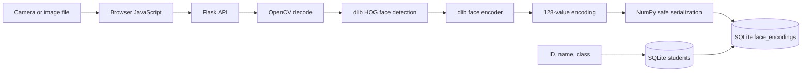
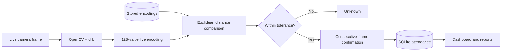

# FaceTrack

> Local, browser-based face-recognition attendance built with Flask, OpenCV,
> dlib, SQLite, and vanilla JavaScript.


FaceTrack registers students from a browser camera or image files, recognizes
faces in named attendance sessions, stores attendance in SQLite, and exports
filterable CSV and Excel reports. The main workflow runs entirely through a
local web interface.

> [!WARNING]
> Multi-frame confirmation is not liveness detection. A photograph or screen
> may fool ordinary face recognition. Obtain consent and do not use this
> development project as the sole basis for consequential decisions.

## Table of contents

- [Features](#features)
- [How it works](#how-it-works)
- [Technology and model roles](#technology-and-model-roles)
- [Repository structure](#repository-structure)
- [Quick start with VS Code](#quick-start-with-vs-code)
- [Using FaceTrack](#using-facetrack)
- [Configuration](#configuration)
- [Testing](#testing)
- [Command-line tools](#command-line-tools)
- [Data and privacy](#data-and-privacy)
- [Troubleshooting](#troubleshooting)
- [Contributing and security](#contributing-and-security)

## Features

- Register students using browser-camera captures or JPEG/PNG files
- Store multiple face encodings for each student
- Safely add samples to an existing matching identity
- Recognize faces from a live browser camera
- Require multiple confirmed frames before marking attendance
- Use named sessions and optional class filtering
- Mark attendance manually when recognition is unsuitable
- Browse and filter the student directory
- Delete students and cascade related encodings and attendance
- Filter reports by date, session, and class
- Download CSV, Excel, or a ZIP containing both
- Create and migrate the SQLite database automatically
- Run from VS Code with included debugger, tasks, and test discovery

## How it works

### Registration and data storage



The browser workflow keeps images in memory while processing. It stores the
numeric face encoding, not the original camera image.

### Recognition and attendance



For the full pipeline, model details, cache behavior, and database ER diagram,
read [docs/ARCHITECTURE.md](docs/ARCHITECTURE.md).

## Technology and model roles

| Technology/model | What it does |
|---|---|
| Browser `getUserMedia` | Opens the camera and captures frames |
| Flask | Serves pages, validates requests, coordinates recognition, and exports reports |
| OpenCV | Decodes images and converts BGR pixels to RGB |
| dlib HOG detector | Finds face locations; it does not identify people |
| dlib landmark model | Aligns the detected face for encoding |
| dlib ResNet face model | Produces a 128-value face representation |
| `face_recognition` | Provides the Python detection, encoding, and distance APIs |
| Euclidean distance | Finds the closest registered encoding |
| Multi-frame confirmation | Application logic that reduces one-frame instability |
| SQLite | Stores students, encodings, and attendance |
| pandas/openpyxl | Produces CSV and Excel reports |

## Repository structure

```text
face_attendance_web/
├── .github/
│   ├── ISSUE_TEMPLATE/        # Structured bug and feature forms
│   ├── workflows/tests.yml    # GitHub Actions test workflow
│   └── PULL_REQUEST_TEMPLATE.md
├── .vscode/
│   ├── launch.json            # F5 Flask debugger
│   ├── settings.json          # Interpreter and unittest discovery
│   └── tasks.json             # Install and test tasks
├── docs/
│   └── ARCHITECTURE.md        # Models, pipelines, and database design
├── static/
│   ├── css/app.css
│   └── js/
│       ├── attendance.js
│       ├── common.js
│       └── register.js
├── templates/                 # Flask/Jinja pages
├── tests/                     # Database and web application tests
├── app.py                     # Web application and APIs
├── database.py                # SQLite schema, migration, and queries
├── export_report.py           # CLI report exporter
├── register_student.py        # CLI registration
├── take_attendance.py         # CLI attendance
├── requirements.txt
├── CONTRIBUTING.md
├── SECURITY.md
└── README.md
```

The Python entry points remain at the repository root so Flask template/static
discovery and the existing VS Code launch configuration work without path
modifications.

Generated local data is ignored by Git:

- `.venv/`
- `attendance.db`
- `attendance_records/`
- `dataset/`
- Python caches

## Quick start with VS Code

### Prerequisites

- [Visual Studio Code](https://code.visualstudio.com/)
- Microsoft's VS Code **Python** extension
- Python 3.11 or 3.12
- A supported browser with camera permission

Python 3.11/3.12 is recommended because dlib may require source patches on
newer Python versions.

Native tools may be required when dlib builds locally:

| Platform | Required tools |
|---|---|
| Windows | CMake and Visual Studio Build Tools with **Desktop development with C++** |
| macOS | `xcode-select --install` and CMake |
| Debian/Ubuntu | `sudo apt install build-essential cmake python3-dev` |

### 1. Clone and open

```bash
git clone https://github.com/OWNER/REPOSITORY.git
cd REPOSITORY
code .
```

Replace `OWNER/REPOSITORY` with the repository's actual GitHub path.

### 2. Create the environment

Windows PowerShell:

```powershell
py -3.12 -m venv .venv
.venv\Scripts\Activate.ps1
```

macOS/Linux:

```bash
python3.12 -m venv .venv
source .venv/bin/activate
```

If Python 3.12 is unavailable, substitute Python 3.11.

### 3. Select the interpreter

Open the VS Code Command Palette (`Ctrl+Shift+P` or `Cmd+Shift+P`), run
**Python: Select Interpreter**, and select the interpreter inside `.venv`.

### 4. Install dependencies

```bash
python -m pip install --upgrade pip
python -m pip install -r requirements.txt
```

You can instead run **Terminal → Run Task → Install FaceTrack dependencies**.

Verify the recognition stack:

```bash
python -c "import cv2, dlib, face_recognition; print('Recognition ready')"
```

### 5. Test

```bash
python -m unittest discover -s tests -v
```

### 6. Run

Use **Run and Debug → Run FaceTrack Web App → F5**, or:

```bash
python app.py
```

Open [http://127.0.0.1:5000](http://127.0.0.1:5000).

Browsers permit camera access on the local `127.0.0.1`/`localhost` secure
context. Stop the server with `Ctrl+C` or VS Code's Stop button.

## Using FaceTrack

### 1. Register a student

Open **Register student**, enter a unique ID, name, and optional class, then:

1. start the camera and allow permission, or select JPEG/PNG files;
2. add 5–10 clear samples containing exactly one face;
3. vary the angle slightly and avoid backlighting;
4. select **Save student**.

Each accepted image creates one 128-value encoding. To add samples later,
provide the exact saved ID, name, and class and enable **Add samples to an
existing student**.

### 2. Take attendance

Open **Take attendance**:

1. enter a meaningful session name;
2. optionally choose a class filter;
3. keep the default `0.50` tolerance initially;
4. choose the required confirmation frames (default: `3`);
5. start attendance and allow camera permission.

Recognition states:

- **Green:** matched and marked present
- **Orange:** matched and awaiting more confirmed frames
- **Red:** a face was found but no stored encoding matched

A student is stored once per date and session. Manual attendance remains
available by student ID.

### 3. Manage students

The **Students** page shows IDs, classes, sample counts, and creation dates.
Deleting a student also deletes their encodings and attendance through SQLite
foreign-key cascades.

### 4. Export reports

The **Reports** page filters by date/all records, session, and class:

- **CSV:** UTF-8 spreadsheet/data-import format
- **Excel:** `.xlsx`; all-record exports include a summary sheet
- **Both:** ZIP containing CSV and Excel

## Configuration

Important settings in `app.py`:

| Setting | Default | Meaning |
|---|---:|---|
| Match tolerance | `0.50` in UI | Lower is stricter |
| Confirmation frames | `3` in UI | Consecutive matches required |
| Registration images | maximum `20` | Images per request |
| Image size | maximum `5 MB` | Per decoded image |
| Request size | maximum `25 MB` | Flask request limit |
| Encoding cache | `5 seconds` | Avoids a database read per frame |
| Scan-state expiry | `15 minutes` | Removes inactive confirmation state |
| Host | `127.0.0.1` | Local computer only |
| Port | `5000` | Local web address |

Set a stable Flask session secret when needed:

```bash
export ATTENDANCE_SECRET_KEY="replace-with-a-long-random-value"
python app.py
```

PowerShell:

```powershell
$env:ATTENDANCE_SECRET_KEY = "replace-with-a-long-random-value"
python app.py
```

## Testing

Run locally:

```bash
python -m unittest discover -s tests -v
python -m pip check
```

Tests do not require webcam hardware. GitHub Actions runs the same suite on
Python 3.12 for pushes and pull requests.

## Command-line tools

Activate `.venv` first.

```bash
# Initialize or migrate the database
python database.py

# Register from a folder
python register_student.py --id S001 --name "Alice Smith" \
  --class "CS101" --folder "/path/to/images"

# Register from a webcam
python register_student.py --id S001 --name "Alice Smith" \
  --class "CS101" --webcam

# Take attendance in an OpenCV window
python take_attendance.py --session "CS101 Morning" --class "CS101"

# Export all reports
python export_report.py --all --format both
```

Use `--add-images` when intentionally adding samples to an existing matching
student. CLI exports are written to `attendance_records/`.

## Data and privacy

The generated `attendance.db` contains biometric face encodings and attendance
records. Treat it as sensitive.

- Web registration images are processed in memory and not saved as files.
- Encodings use NumPy `.npy` byte streams with `allow_pickle=False`.
- Legacy pickle encodings are skipped and require re-registration.
- CSRF tokens protect state-changing browser requests.
- The default server binds only to `127.0.0.1`.
- There is no authentication, encryption at rest, HTTPS, or liveness model.

Back up the database only while the server is stopped:

```bash
cp attendance.db attendance-backup.db
```

Never commit databases, face images, reports, or secrets to GitHub.

## Troubleshooting

### Module not found

Confirm VS Code selected `.venv`, then run:

```bash
python -c "import sys; print(sys.executable)"
python -m pip install -r requirements.txt
```

### dlib installation fails

Install the platform's native tools listed above. If using Python 3.13/3.14,
recreate the environment with Python 3.11 or 3.12—the supported path for a
clean installation.

### `pkg_resources` error

`face_recognition_models` still depends on this compatibility module:

```bash
python -m pip install "setuptools<81"
```

### Camera does not open

- Use `http://127.0.0.1:5000`.
- Allow camera access in browser site settings.
- Allow the browser in operating-system camera privacy settings.
- Close other programs using the camera.

### Known student appears unknown

- Check that the class filter includes the student.
- Add varied, well-lit samples.
- Keep the complete face visible.
- Adjust tolerance only in small steps after testing false matches.

### Wrong student is matched

Lower the tolerance, re-register poor samples, use a class filter, and require
manual review. Do not solve false matches merely by adding more confirmation
frames; confirmation repeats a match but does not make the identity model more
accurate.

## Contributing and security

Read [CONTRIBUTING.md](CONTRIBUTING.md) before opening a pull request. Report
sensitive vulnerabilities using the process in [SECURITY.md](SECURITY.md), not
a public issue.

This repository does not declare an open-source license. Add an appropriate
`LICENSE` file before distributing or accepting contributions under specific
license terms.
