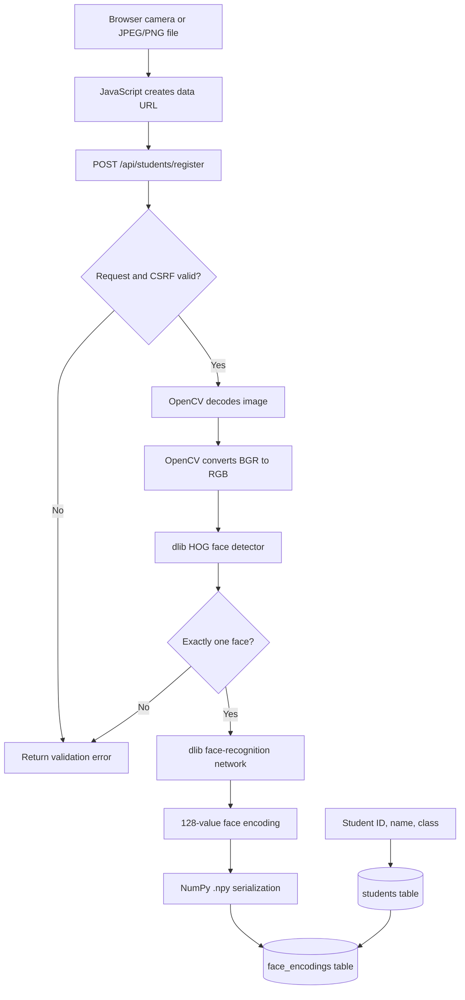
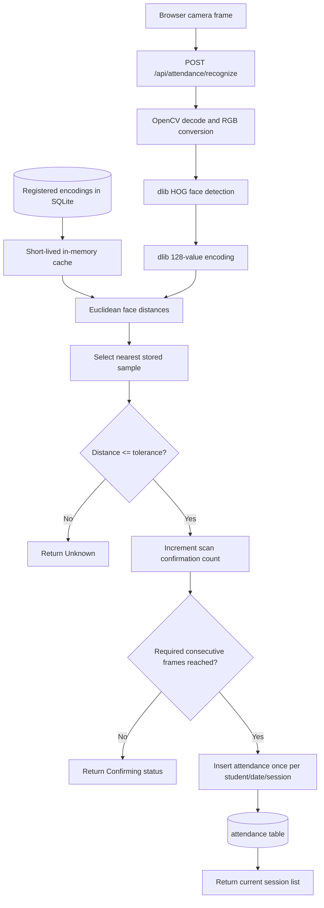
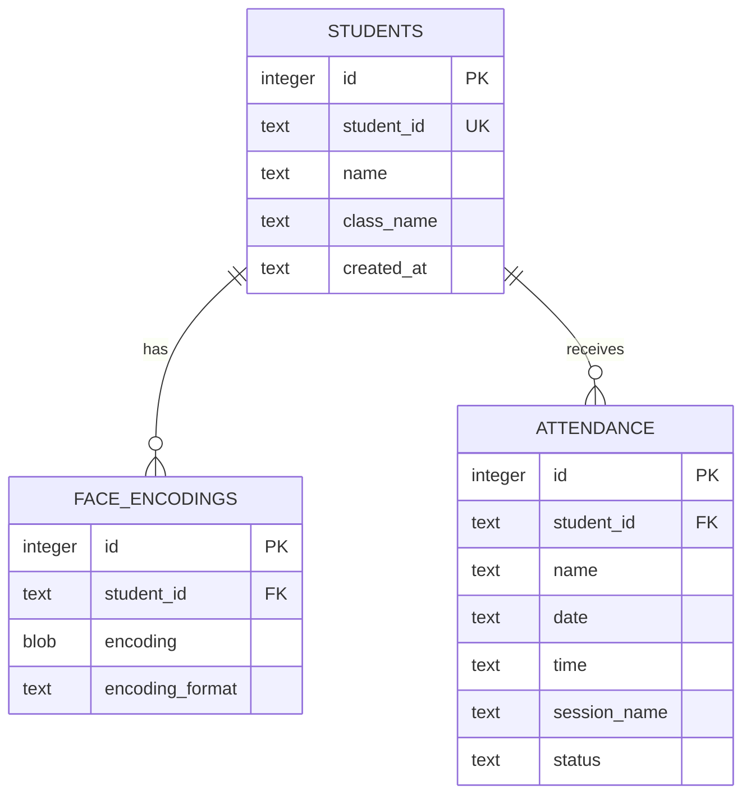

# FaceTrack architecture

This document describes how browser images become face encodings and attendance
records. For installation and normal use, see the [project README](../README.md).

## Components

| Component | Responsibility |
|---|---|
| Browser HTML/CSS/JavaScript | Camera access, frame capture, controls, overlays, and API requests |
| Flask (`app.py`) | Pages, validation, CSRF protection, APIs, recognition orchestration, and downloads |
| OpenCV | JPEG/PNG decoding, BGR-to-RGB conversion, resizing, and CLI camera access |
| dlib HOG detector | Locates faces in each RGB image |
| dlib face-recognition network | Converts a detected face into a 128-value embedding |
| `face_recognition` | Python API around dlib detection, encoding, and distance calculation |
| NumPy | Encoding arrays, serialization, and nearest-distance selection |
| SQLite (`database.py`) | Students, encodings, attendance, constraints, and migration |
| pandas/openpyxl | CSV and Excel report generation |

## Registration and storage flow

The original browser image is not written to disk by the web workflow. Only the
numeric encoding is stored.

## Recognition and attendance flow

## What each model does

### HOG face detector

`face_recognition.face_locations(..., model="hog")` uses dlib's
Histogram-of-Oriented-Gradients detector. It answers: **where are the faces?**
It returns bounding boxes but does not identify people.

HOG was chosen instead of the optional CNN detector because it runs locally on
ordinary CPUs without CUDA. It is less robust to difficult angles than modern
detectors.

### Face landmark and encoding models

`face_recognition.face_encodings(...)` uses dlib's landmark model to align the
detected face, then dlib's ResNet-based face-recognition network to produce a
128-dimensional embedding. It answers: **what numeric representation describes
this face?**

The embedding is not a photograph, but it remains biometric data.

### Distance matching

`face_recognition.face_distance(...)` calculates Euclidean distance between the
live encoding and stored encodings. This is a comparison calculation, not a
separately trained project model.

The smallest distance is selected. A match is accepted only when that distance
is at or below the configured tolerance. Lower tolerance is stricter.

### Multi-frame confirmation

Confirmation is application logic, not a machine-learning model. A recognized
student must appear in the configured number of consecutive processed frames.
This reduces one-frame instability but does not provide liveness detection.

## Database relationships

The attendance table enforces uniqueness for `student_id + date +
session_name`. Deleting a student cascades to their encodings and attendance.

## Safety boundaries

- The server binds to `127.0.0.1` by default.
- Unsafe HTTP methods require a Flask-session CSRF token.
- Images and requests have explicit size/count limits.
- Encoding deserialization uses `allow_pickle=False`.
- Legacy pickle encodings are skipped and require re-registration.
- No authentication, authorization, encryption at rest, or liveness model is
  included.
